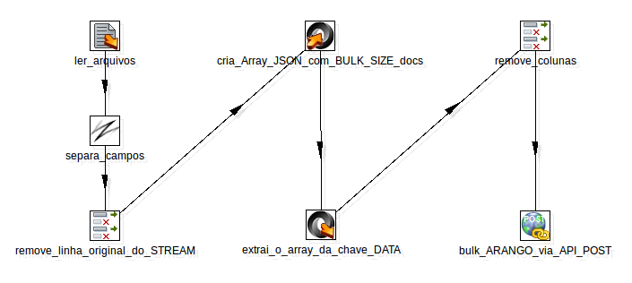

Bulk insert no ArangoDB utilizando o PDI (Pentaho Data Integration).
===================================================================

## Introdução

Este é um exemplo de projeto de como fazer inclusão em lote (Bulk insert) no banco de dados [ArangoDB](https://www.arangodb.com/) .

O esquema deste exemplo se resume na seguinte figura:

[](https://nodesource.com/products/nsolid)

## Como utilizar:

Uma vez feito o clone deste projeto, basta executar o comando `pan.sh`, passando os valores para os seguintes parâmetros:
 - FOLDER_IN: A pasta que contém os arquivos a serem lidos;
 - MASK_IN: A máscara dos nomes dos arquivos a serem lidos. Padrão: .*log
 - ARANGO_URL: URL com a porta de acesso ao Arango. Padrão http://localhost:8529/
 - BULK_SIZE: A quantidade de linhas que serão inseridas em lote no ArangoDB. Padrão: 2000.

OBSERVAÇÕES:
 - O ArangoDB utilizado pra este exemplo estava sem autenticação. 
 - Foi utilizado uma instalação do ArangoDB do Docker. Veja aqui o [ArangoDB DockerImage](https://hub.docker.com/r/arangodb/arangodb/)
 - Se precisar fornecer mais memória pro PDI, utilize: ```export PENTAHO_DI_JAVA_OPTIONS=-Xmx4096m``` antes de executá-lo. Neste exemplo forneci 4GB.
 - O Bulk está sendo realizado via HTTPPost. Para saber mais, veja [aqui na documentação do ArangoDB](https://docs.arangodb.com/2.8/HttpBulkImports/)

## Exemplo de uso:

Uma vez dentro da pasta do PDI, '/data-integration' ou tê-lo no PATH, excutar:

```
./pan.sh  \
    -file  ~/workspaces/exemplo_arango/load_logs_to_arango.ktr     \
    -param FOLDER_IN=/home/wseidel/workspaces/aRepositorios_PDI/rafa_arango/logs  \
    -param MASK_IN=.*log \
    -param ARANGO_URL=http://localhost:8529/  \
    -param BULK_SIZE=2000
```


